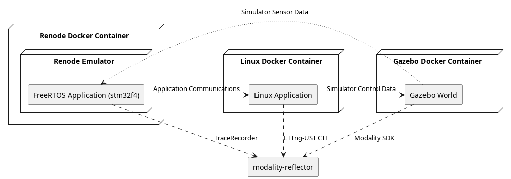

# System Demo

## Overview



## Getting Started

1. Setup new user/workspace
  ```bash
  ./scripts/setup_modality.sh
  ```
2. Build the docker images and applications
  ```bash
  ./scripts/build.sh
  ```
3. In a separate terminal, run the networking setup script
  ```bash
  sudo ./scripts/setup-network.sh
  ```
4. Export your auth token (in each terminal used)
  ```bash
  export MODALITY_AUTH_TOKEN=$(modality user auth-token)
  ```
5. Run the system (starts modality-reflector and the detached docker containers), automatically stops after contact is made in gazebo
  ```bash
  # Set DEMO_HEADLESS env var to not run any of the GUIs (gazebo, renode, etc)
  # Set DOCKER_WITHOUT_NVIDIA env var to omit GPU support in docker
  ./scripts/run-until-contact.sh
  ```

## Robot Framework

1. Setup new user/workspace
  ```bash
  ./scripts/setup_modality.sh
  ```
2. Build the docker images and applications
  ```bash
  ./scripts/build.sh
  ```
3. Setup the python venv and install dependencies
  ```bash
  ./scripts/setup_robot_framework.sh
  ```
4. Run the robot framework tests
  ```bash
  ./scripts/run_robot_framework.sh
  ```
5. Optionally view the report html (assumes firefox)
  ```bash
  ./scripts/view_report.sh
  ```
